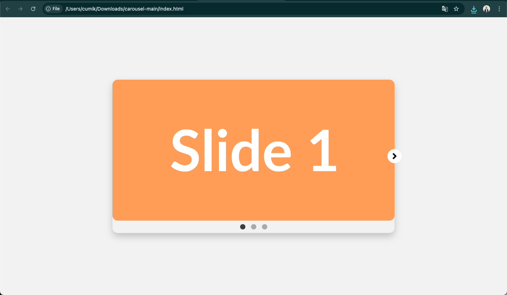

# Simple JavaScript Carousel


A lightweight, responsive, and easy-to-use image carousel built from scratch using pure HTML, CSS, and JavaScript. This project is a great way to understand the fundamentals of DOM manipulation, event handling, and CSS transitions without relying on any external libraries.



---

## ## Table of Contents

* [Features](#features)
* [Technologies Used](#technologies-used)
* [File Structure](#file-structure)
* [Getting Started](#getting-started)
* [How to Use](#how-to-use)
* [Customization](#customization)
* [License](#license)

---

## ## Features

* **Autoplay**: The carousel automatically cycles through slides.
* **Pause on Hover**: Autoplay intelligently pauses when the user's mouse is over the carousel and resumes when it leaves.
* **Vanilla JavaScript**: No dependencies or frameworks needed.
* **Responsive Design**: Adapts to different screen sizes.
* **Arrow Navigation**: Includes "Next" and "Previous" buttons.
* **Dot Indicators**: Allows users to jump to any specific slide.
* **Smooth Animations**: Utilizes CSS transitions for a fluid sliding effect.

---

## ## Technologies Used

* **HTML5**: For the structure and content of the carousel.
* **CSS3**: For all styling, layout (Flexbox), and animations.
* **JavaScript (ES6)**: For all the interactive logic and DOM manipulation.

---

## ## File Structure

The project is organized into three main files:

```

simple-js-carousel/
├── index.html     \# The main HTML file containing the carousel structure.
├── style.css      \# The CSS file for styling all the elements.
└── script.js      \# The JavaScript file for functionality and interactivity.

````

---

## ## Getting Started

To get a local copy up and running, follow these simple steps.

1.  **Clone the repository**:
    ```sh
    git clone [https://github.com/your-username/simple-js-carousel.git](https://github.com/your-username/simple-js-carousel.git)
    ```
2.  **Navigate to the project directory**:
    ```sh
    cd simple-js-carousel
    ```
3.  **Open `index.html` in your web browser**.

No special tools or builds are required!

---

## ## How to Use

The carousel will begin to play automatically when the page loads.

* **Hover** over the carousel to pause the autoplay feature.
* Click the **right arrow (`>`)** to move to the next slide.
* Click the **left arrow (`<`)** to move to the previous slide.
* Click on one of the **dots** at the bottom to jump directly to the corresponding slide.

---

## ## Customization

It's easy to customize the carousel:

### ### Changing Autoplay Speed

1.  Open the `script.js` file.
2.  Find the `startAutoplay` function.
3.  Change the `3000` value to your desired interval in milliseconds (e.g., `5000` for 5 seconds).

    ```javascript
    // From this:
    autoplayInterval = setInterval(() => { ... }, 3000);

    // To this (for a 5-second delay):
    autoplayInterval = setInterval(() => { ... }, 5000);
    ```

### ### Adding or Removing Slides

1.  Open the `index.html` file.
2.  Inside the `<ul class="carousel-track">`, add or remove `<li>` elements.
3.  Inside the `<div class="carousel-nav">`, make sure the number of `<button class="carousel-indicator">` elements matches the number of slides.

---

## ## License

This project is licensed under the MIT License. See the `LICENSE` file for details.
````

This format is more detailed and follows common conventions, making your project much more approachable for other developers. Let me know if you have any other questions\!
